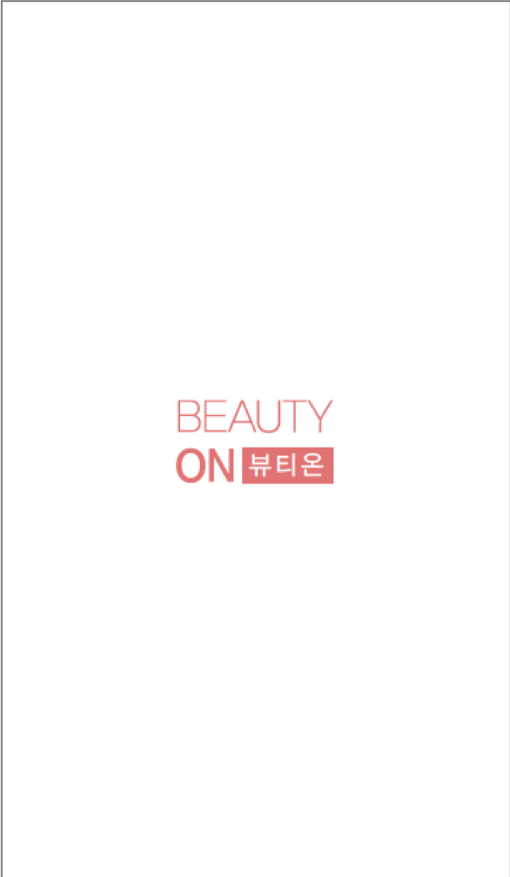
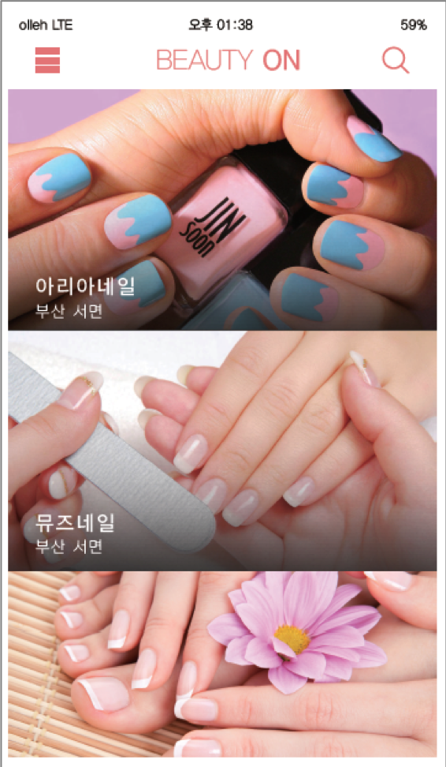
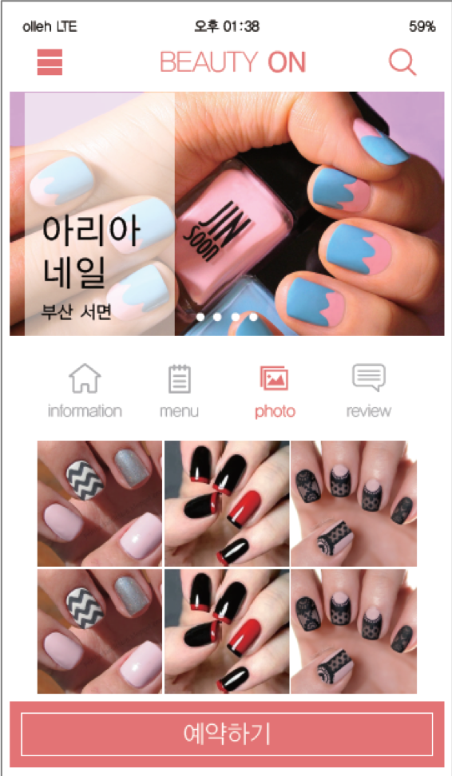
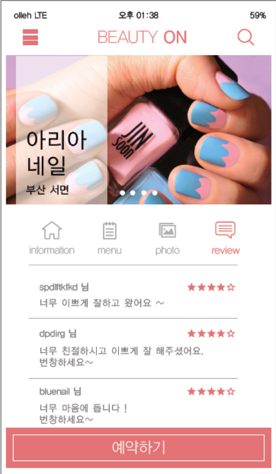
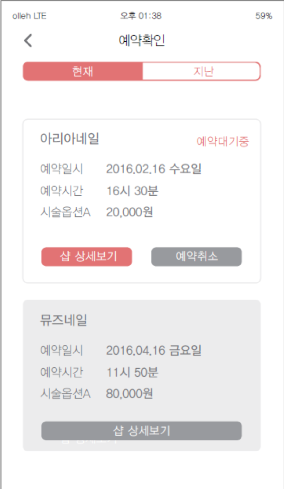
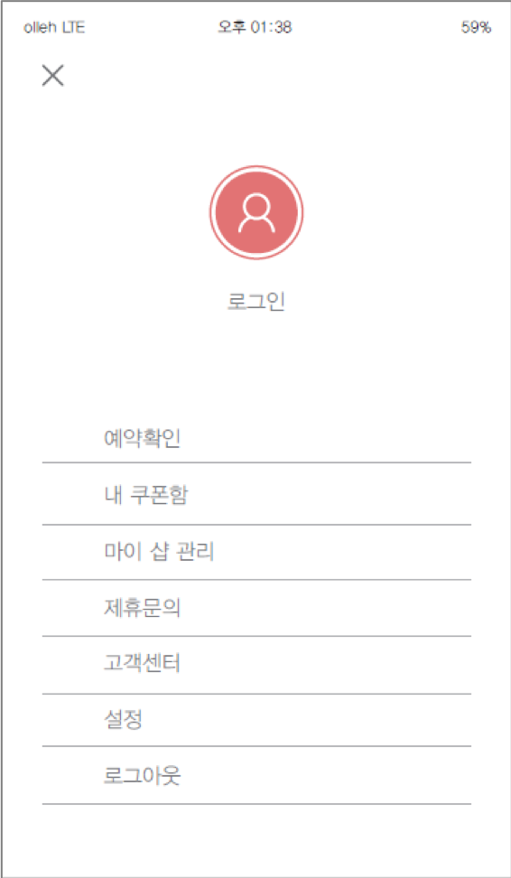

# Beautyshop_reserve
뷰티샵(헤어샵, 네일샵) 예약 시스템

## 배경
- 창업팀 활동
- 2016년 당시 오픈 형식의 뷰티샵 예약 플랫폼이 전무한 상황
- 미용실, 네일샵의 시장확대에 따른 예약 수요 증가를 판단하여 아이디어 확정
- 개발 담당

## 제공기능
- 사용자는 뷰티샵 예약자와 뷰티샵 운영자로 나뉜다.
- 예약자
  - 뷰티샵을 시간, 디자이너, 상품을 구분해서 예약 할 수 있다.
  - 리뷰를 남길 수 있다.
- 운영자
  - 예약 관리(예약 승인/거부, 예약 현황 조회)를 할 수 있다.
  - 포트폴리오를 공유할 수 있다.

## 개발환경
- php
- mySQL

## 개발 화면

 

- 개발 환경 제거로 현재 구동 불가능